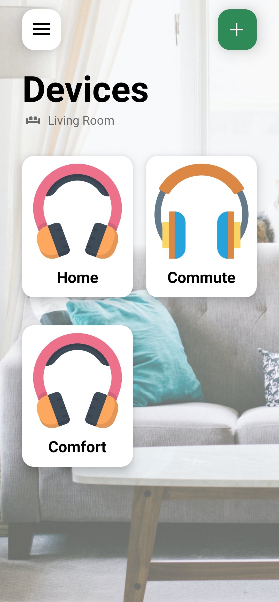
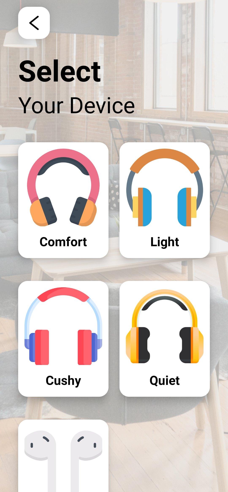
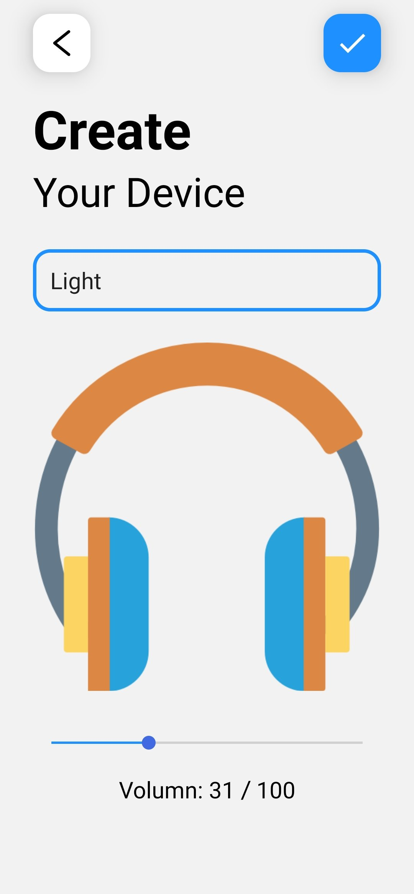
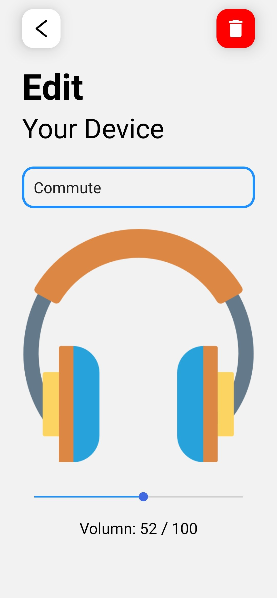

# Application Name
Kozy

# Description
This application is built with React Native to demonstrate how to manage global states through Redux.

# Screenshots

# Introduction
* Home Screen
  * Mapping the state of store
  * Display cards
* Select Screen
  * Display a selection of cards
* Create Screen
  * Screen for creating a new device
  * Adding new device to the store
* Edit Screen
  * Screen for modification
  * Editing device of the store
  * Deleting device from the store

# Dependencies
- [redux](https://redux.js.org/)
- [react-redux](https://react-redux.js.org/introduction/quick-start)
- [react-navigation](https://reactnavigation.org/)
- [react-native-paper](https://callstack.github.io/react-native-paper/)